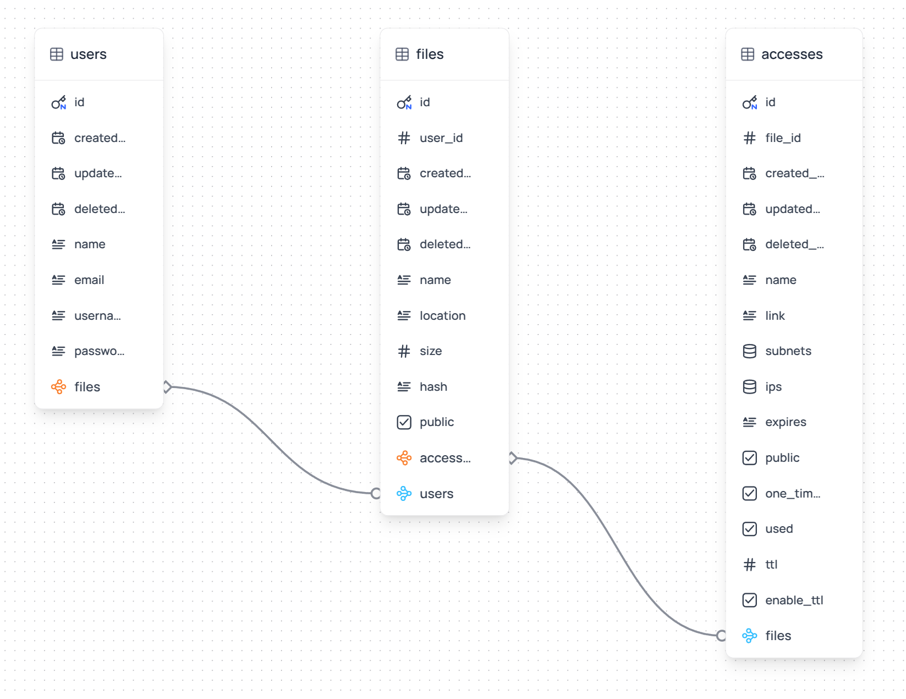

# Defdrive

Defdrive is a project that allows users to create multiple expiry keys based on time and has features like one-time use of the link, specific data traffic allowed, subnet restriction, public IP restriction, and TTL (Time to Live).

## Features

- User authentication with JWT
- Create and manage expiry keys
- One-time use links
- Data traffic control
- Subnet restriction
- Public IP restriction
- TTL (Time to Live)

## Setup

1. Clone the repository
2. Create a `.env` file in the root directory. Take `.env.example` for reference.
3. Ensure a PostgreSQL database is running on the specified port and set all necessary environment variables in the `.env` file.
4. Run `go mod tidy` to install dependencies.
5. Run `go run main.go` to start the server

## Running with Docker Compose

1. Clone the repository
2. Create a `.env` file in the root directory. Take `.env.example` for reference.
3. Run `docker-compose up --build` to start the services

## API Endpoints

- `POST /api/auth/login`: Authenticate a user and return a JWT token.
- `POST /api/keys`: Create a new expiry key.
- `GET /api/keys`: Retrieve all expiry keys.
- `GET /api/keys/:id`: Retrieve a specific expiry key by ID.
- `DELETE /api/keys/:id`: Delete a specific expiry key by ID.
- `POST /api/links`: Create a one-time use link.
- `GET /api/links/:id`: Retrieve a specific link by ID.
- `DELETE /api/links/:id`: Delete a specific link by ID.
- `POST /api/accesses`: Create a new access record with optional one-time use, subnet restriction, and public IP restriction.
- `PUT /api/accesses/:accessID`: Update an existing access record with optional one-time use, subnet restriction, and public IP restriction.

## Data Base (Models)

 

